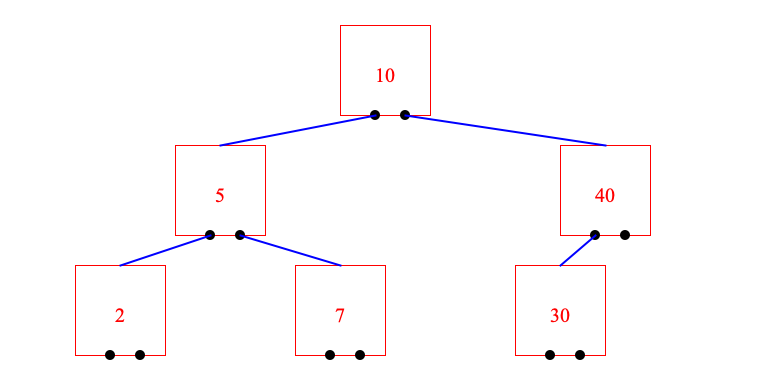

# Tree Viz
Java code to visualize trees (Binary + B Tree)

### TL;DR
The CompactTreeViz takes a tree-description and draws the tree in a png file. The tree-description is an ArrayList<String> and leverages the format propose by [Jim Blackler](http://jimblackler.net/treefun/index.html).

### Sample Binary Search Tree

### Sample BTree

###  Usage
run `Main.java` from package `src.tree_viz`. This is an eclipse project.

### TODO
* Update readme file with credits
* Write the story of this project
* Add credits to readme file

### Contributor list
While TreeViz is a one man job, I borrowed somethings from others and I want to make this clear.
1. I use the tree format propose by [Jim Blackler](http://jimblackler.net/treefun/index.html). This allows TreeViz to support any tree structure and not just binary trees.
2. Since this tool is about visualization only, I borrowed the BST and the BTree implementations from [mvyas85](https://github.com/mvyas85/Binary-Tree/blob/master/src/BST/BinarySearchTree.java) and [phishman3579](https://github.com/phishman3579/java-algorithms-implementation/blob/master/src/com/jwetherell/algorithms/data_structures/BTree.java), respectively.

### Release History
* First code commit on 16 April 2021

### Misc Notes

* I developed TreeViz while I was TAing CMSC420 with Jason Filippou. CMSC420 is an advanced data-structures class with a lot of projects about various trees (BST, AVL, BTree, QuadTree). TreeViz is **not** part of the course requirements; I developed TreeViz to help me debug my implementation. TreeViz helped me visualize my trees after every insertion/deletion, i.e., find bugs faster.  